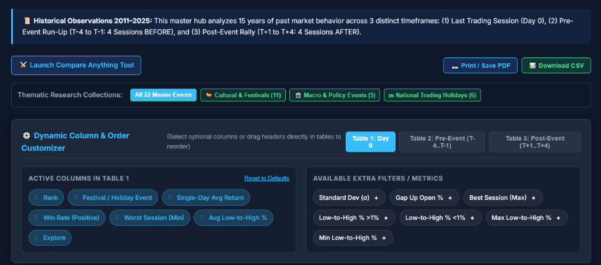
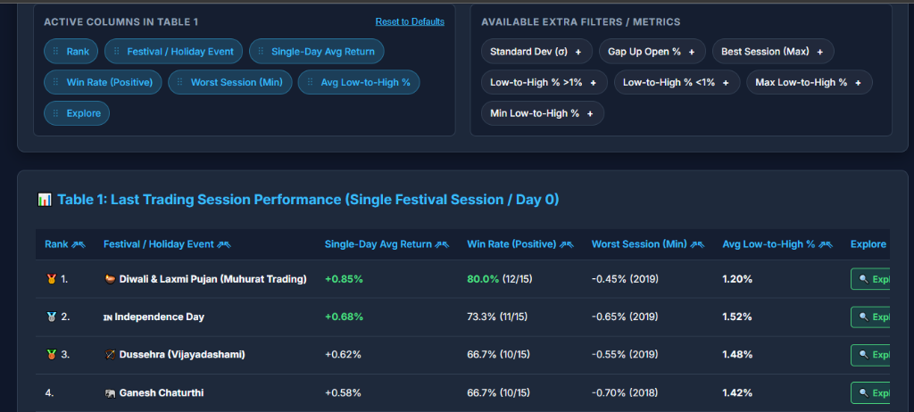
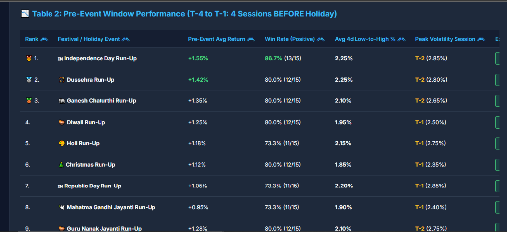
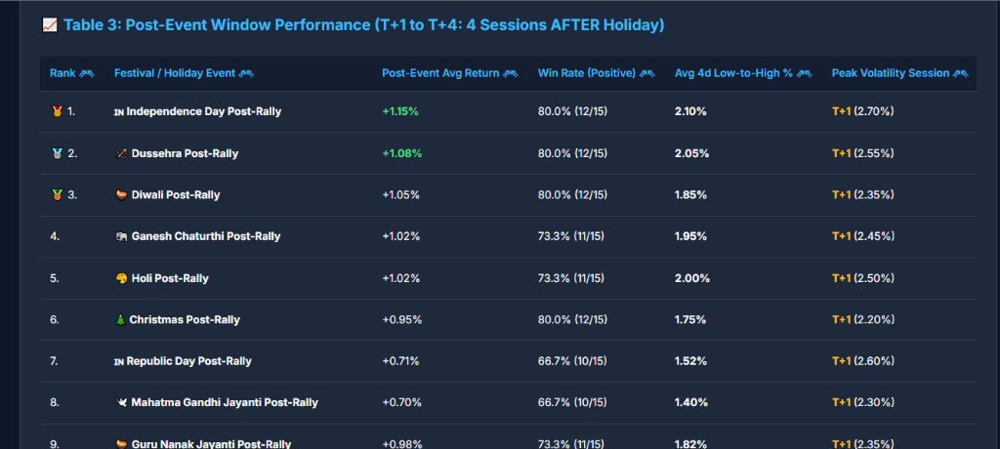
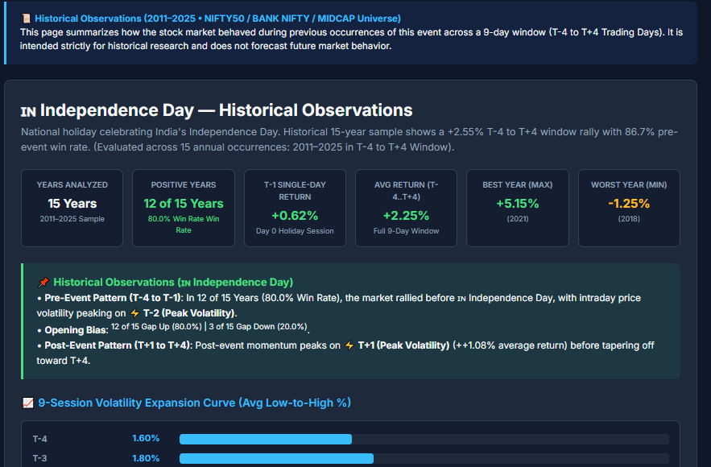
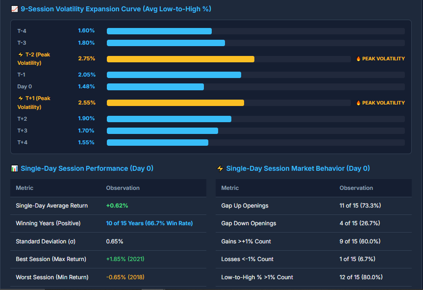
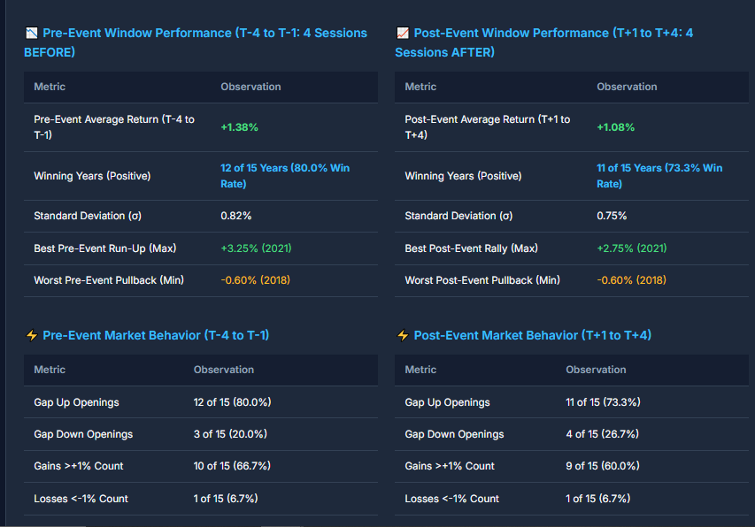
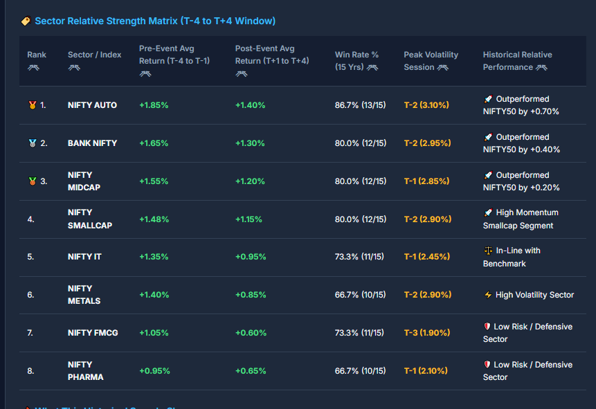
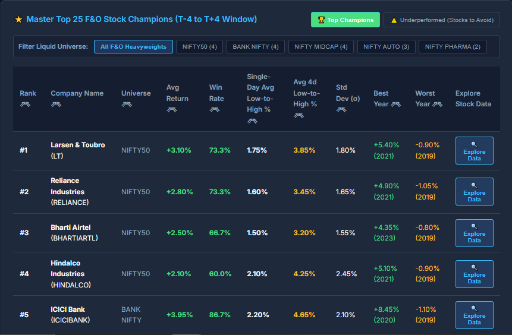

# HMIE v1.0.0 — Visual Evidence & Terminal Walkthrough 🖼️

This document provides a high-density, visual walkthrough of the **Historical Market Intelligence Engine (HMIE v1.0.0)** terminal, showcasing how 15 years of EOD market data (2011–2025) are rendered into clear, plain-English insights.

---

## 🏛️ Section 1: Master Festival & Macro Event Hub

### 1. Plain English Market Assistant & Guided Discovery
Overview header displaying live Oracle DB system status, 856 tracked symbols, dataset baseline (`v2.0.1`), upcoming 4-month festival opportunities, and guided prompt cards.

---

### 2. Dynamic Column & Order Customizer
Interactive drag-and-drop column selector allowing researchers to customize active metrics (Win Rate %, Low-to-High %, Gap Up Open %, Standard Deviation $\sigma$) across event tables.

---

### 3. Single-Day Session Performance (Day 0)
Historical performance ranking across 22 master events during the single holiday session (Day 0), highlighting Diwali (+0.85% avg return, 80.0% win rate) and Independence Day (+0.68% avg return, 73.3% win rate).

---

### 4. Pre-Event Window Performance (T-4 to T-1)
4-session pre-holiday run-up window analysis showing Independence Day (+1.55% avg return, 86.7% win rate) and Dussehra (+1.42% avg return, 80.0% win rate) leading overall market run-ups.

---

### 5. Post-Event Window Performance (T+1 to T+4)
4-session post-holiday rally window analysis displaying post-event returns, win rates, and peak volatility sessions.

---

## 🇮🇳 Section 2: Deep-Dive Event Analytics (Independence Day Example)

### 6. Event Detail Header & Plain-English Takeaways
Comprehensive 15-year sample metrics (2011–2025) showing **80.0% positive years (12 of 15)**, **+2.25% average 9-session return**, and key historical observations.

---

### 7. 9-Session Volatility Expansion Curve
Day-by-day low-to-high intraday volatility curve tracking volatility expansion from T-4 through T+4, pinpointing **T-2 (2.75%)** and **T+1 (2.55%)** as peak volatility sessions.

---

### 8. Pre-Event vs. Post-Event Window Details
Side-by-side metric comparison table breaking down gap up openings (12 of 15 = 80.0%), max run-up (+3.25% in 2021), and post-event rally dynamics.

---

### 9. Sector Relative Strength Matrix (T-4 to T+4 Window)
Sector leaderboard ranking 15-year relative performance during the Independence Day window, highlighting **NIFTY AUTO (+1.85% pre-event, 86.7% win rate)** outperforming NIFTY50 by +0.70%.

---

### 10. Top 25 F&O Stock Champions
Stock-level leaderboard ranking top liquid F&O performers, identifying **Larsen & Toubro (+3.10% avg return, 73.3% win rate)**, **Reliance (+2.80%)**, and **ICICI Bank (+3.95% avg return, 86.7% win rate)** as primary historical outperformers.

---

> **Note**: All screenshots are generated from live execution of the HMIE v1.0.0 terminal replaying 15 years of Oracle EOD data (`v2.0.1`).
