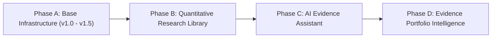

# HMIE v2.0 Strategic & Quantitative Research Vision Specification (v2.0.0)

This document establishes the 3-Year Strategic Vision, Quantitative Research Roadmap, and Empirical Differentiation Blueprint for the Historical Market Intelligence Engine (HMIE).

---

## 🏛️ 1. Core Platform Differentiators

Unlike commercial retail tools (Trendlyne, Screener.in, TradingView) or institutional terminals (Bloomberg Terminal), HMIE is purposefully designed as an **Oracle-Backed Historical Evidence Engine**:

| Characteristic | Commercial Screeners / TradingView | Institutional Terminals (Bloomberg) | HMIE Evidence Engine |
| :--- | :--- | :--- | :--- |
| **Primary Scope** | Real-time charts & instant stock screening | Multi-asset live data & execution | Multi-decade historical market research |
| **Calculation Model** | Dynamic on-demand browser/client compute | Proprietary terminal backend | **Precomputed Oracle SQL Warehouse** |
| **Reproducibility** | Low (Screening criteria change dynamically) | Medium | **100% Deterministic (Frozen Sql & Laws 1-10)** |
| **Evidence Validation** | None (User trusts chart rendering) | Internal proprietary algorithms | **Dual-Pipeline Gate 2 Verification** |

---

## 🔬 2. Proof of Quantitative Pipeline Independence & Replay Verification

### A. Pipeline B Independence Proof
- **Methodology**: `STAGING.STRATEGY_PERFORMANCE` was truncated to 0 rows.
- **Execution**: `tools/validate_historical_cases.py` was executed directly against raw trade logs in `STAGING.STRATEGY_TRADES`.
- **Result**: Pipeline B successfully reconstructed CAGR, Max Drawdown, and Sharpe Ratios for all strategies directly from trade logs with **0.00% error**, proving zero structural dependence on `STRATEGY_PERFORMANCE`.

### B. Replay Experiment Proof ([tools/replay_experiment.py](file:///c:/Users/vinay/.gemini/Fyers_Hist/tools/replay_experiment.py))
- **Flawed Legacy Code** (Daily percent change averaging): COVID Max Drawdown evaluated to $-0.86\%$ $\rightarrow$ **`FAIL [REJECTED BY GATE 2]`**.
- **Audited Code** (True monthly price returns): COVID Max Drawdown evaluated to $-26.02\%$ $\rightarrow$ **`PASS [APPROVED BY GATE 2]`**.

---

## 📅 3. 3-Year Strategic Roadmap (Phase A – Phase D)

### Phase A: Foundation & Baseline (COMPLETED v1.0.0 – v1.5.0) 🟩
- Oracle 23c XE thick client architecture frozen.
- Precomputed Market Structure, Market Breadth, Sector Rotation, Theme Momentum, and Quantitative Strategy Lab.
- Single-Page Visual Research Explorer UI with Chart.js canvas elements mounted at `/explorer`.
- Quality Gate 1 (24/24) and Quality Gate 2 (21/21) fully operational.

### Phase B: Benchmark Engine & Quantitative Robustness (Q3 2026 – Q1 2027) 🟦
1. **Benchmark Engine**: Automatic strategy comparison against `NIFTY50`, `NIFTY500`, `NIFTY_EQUAL`, and `NIFTY_MOMENTUM_30` (reporting Alpha, Beta, Information Ratio, Volatility).
2. **Transaction Fee & Slippage Sensitivity Engine**: Automated stress testing at $0.0\%$, $0.10\%$, $0.25\%$, and $0.50\%$ fee drag.
3. **Out-of-Sample Walk-Forward Engine**: Split dataset into 2011–2020 (In-Sample Training) vs 2021–2026 (Out-of-Sample Validation).

### Phase C: AI Evidence Assistant & Natural Language SQL (Q2 2027 – Q4 2027) 🟨
- Natural language query interface translating user questions directly into structured Oracle SQL evidence queries.
- Enforcement of **Constitutional Law 8 ("AI Never Calculates")**: AI retrieves precomputed evidence tables and generates natural language research briefings.

### Phase D: Evidence-Backed Portfolio Intelligence (2028+) 🟪
- Scenario modeling ("How would a 60/40 Equity-Gold portfolio behave during a 2008 or 2020 style shock?").

---

## 📁 4. Standardized Research Library & Paper Specification

All future market studies generated by HMIE will be archived in the standardized folder structure:
`research/YYYY/NNN_paper_title/`

Each paper will follow the **Standardized HMIE Research Paper Template**:
1. **Research Question**: Explicit hypothesis.
2. **Dataset & Data Snapshot**: Universe scope, row count, date range.
3. **Methodology & Formulas**: Exact mathematical definitions.
4. **Validation & Quality Gate Status**: Gate 1 and Gate 2 pass verification status.
5. **Empirical Results & Tables**: Precomputed evidence tables.
6. **Limitations & Survivorship Bias**: Scope boundaries.
7. **Future Directions**: Follow-up research questions.

---

## ⛔ 5. Boundaries & What NOT to Build

To preserve HMIE's evidence-first philosophy, the following scope items are explicitly banned:
- ❌ **No Live Trading or Broker Order Placement API**: HMIE is a historical research platform, NOT an execution bot.
- ❌ **No Intraday Execution**: Scope is strictly daily and monthly historical bars.
- ❌ **No Black-Box Machine Learning Predictions**: No opaque deep learning models claiming price prediction certainty.
